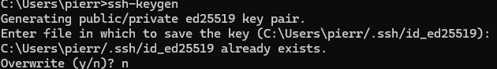
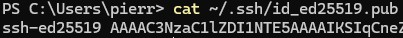
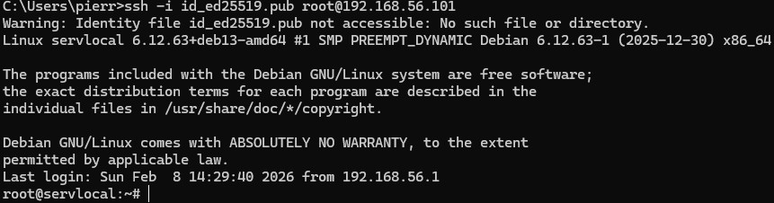
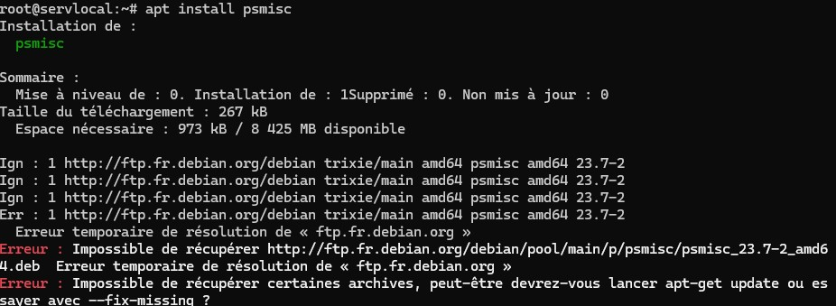

# 1. Secure Shell SSH

## 1.1 Exercice : Connection ssh root

L'élément de configuration que j'ai dû changer afin de permettre une connexion distante au serveur depuis le terminal local de ma machine est `#PermitRootLogin`
en lui passant comme argument `yes` au lieu de `prohibit-password`, cela permet à l'utilisateur Root de se connecter en utilisant SSH.

Avantages et incovénients : https://www.malekal.com/securiser-serveur-ssh/ ### TODO à détaillé

## 1.2 Exercice : Authentification par clef / Génération de clefs

J'ai utilisé la commande `ssh-keygen` afin de générer une clef d'authentification.

Ici dans mon cas j'ai déjà effectué la génération de clef d'authentification, je met donc `n` pour ne pas overwrite ma clef déjà existante.
La suite des étapes lorsque l'on met `y` propose d'enter un mot de passe pour la clef, dans mon cas je n'en ai pas besoin, donc je ne met rien.

```
Created directory '/home/username/.ssh'.
Enter passphrase (empty for no passphrase):
Enter same passphrase again:
```
En revanche dans un cas réel c'est une mauvaise idée de ne pas mettre de `passphrare` car cela signifie que votre clé privée est stockée directement sur le disque. Si quelqu'un de mal intentionné parvient à voler ce fichier il accèdera instantanément au serveur. La `passphrase`ajoute une couche de sécurité critique en chiffrant la clef localement ce qui garantit que même en cas de vol de fichier l'accès reste protégé par la `passphrase`.

## 1.3 Exercice : Authentification par clef / Connection serveur

Pour nous connecter sur notre serveur à l'aide de notre clef publique il faut d'abord la déposer sur le serveur.
Pour cela on va effectuer la commande `ssh-copy-id username@remote_host` si cela ne fonctionne pas, ce qui est mon cas alors il est possible d'effectuer une copie manuelle.
Voici la procédure à suivre :

Tout d'abord on execute la commande `cat ~/.ssh/id_ed25519.pub` ce qui nous affiche notre clef publique.


Ensuite on accède au serveur, puis on créer le dossier .ssh si celui-ci n'existe pas `mkdir -p ~/.ssh`
Puis il suffit d'écrire la commande `echo public_key_string >> ~/.ssh/authorized_keys` en remplaçant `public_key_string` par le résultat du cat.
Cela va copier notre clef dans le fichier `authorized_keys`.

Il faut maintenant désactiver l'authentification au serveur par mot de passe.
Pour cela on va dans le fichier `sshd_config` puis on décommente la ligne `PubkeyAuthentication` et on passe la ligne `PasswordAuthentication yes` à `no` afin de désactiver la connexion par mot de passe textuel.


N'oublions pas de relancer le service SSH avec la commande `systemctl restart ssh`

## 1.4 Exercice : Authentification par clef : depuis la machine hote

Il est possible pour nous maintenant de se connecter depuis notre clef, en executant la commande suivante :
`ssh -i id_ed25519.pub root@192.168.56.101`
Si une passphrase avait été paramétré on aurait eu à entrer la passphrase afin de se connecter, si ce n'est pas le cas, on est alors directement connecté au serveur.



## 1.5 Exercice : S´ecurisez

Pour protéger notre serveur contre les attaques brute force ssh, consistant à tester massivement des combinaisons d'identifiants et de mots de passe il est recommandé de désactiver la connexion par mot de passe de note serveur.
Pour ce faire il suffit d'aller dans notre fichier `/etc/ssh/sshd_config` et de commenter la ligne `PasswordAuthentication no` afin de désactiver l'authentification par mot de passe.
On peut également restreindre l'accès à l'utilisateur root pour plus de sécurité, on interdit la connexion directe en tant que super-utilisateur. Pour ce faire il suffit toujours dans le fichier `sshd_config` de décommenter et changer la ligne `PermitRootLogin yes` à `PermitRootLogin no`.

# 2. Processus
## 2.1 Exercice : Etude des processus UNIX
### 1
En utilisant la commande `ps -aux` il est possible d'afficher toute la liste des processus qui tourne sur le serveur.
L'information **TIME** nous indique le temps depuis lequel est utilisé le processus. Il existe également la commande `top`
Avec la commande `ps -aux --sort=time` il est possible d'afficher le processus qui a été le plus utilisé sur le serveur.
Dans mon cas c'est `kworker` avec 14 minutes d'utilisation.
```
root         969  0.3  0.0      0     0 ?        I    13:51   0:14 [kworker/0:2-events]
```
Pour connaître le premier processus lancé, on utilisé également la commande `ps -aux` mais cette fois-ci on `sort` sur `start`
`ps -aux --sort=start`
J'obtiens le résultat suivant :
```
root           1  0.0  0.7  23780 14884 ?        Ss   13:13   0:01 /sbin/init
```
Donc le premier processus lancé est sbin/init.

Avec la commande `ps -eo pid,lstart,cmd` il est possible de voir quand à démarrer les processus, ici en premier j'ai :
```
root@servlocal:~# ps -eo pid,lstart,cmd
PID                  STARTED CMD
1 dim. févr.  8 13:13:06 2026 /sbin/init
```
La commande `uptime -p` permet d'afficher depuis combien de temps le serveur tourne et de manière jolie (-p pour *pretty*)
```
root@servlocal:~# uptime -p
up 2 hours, 3 minutes
```
Afin de savoir combien de processus ont été créer depuis le démarrage du serveur on peut utiliser la commande `grep '^processes' /proc/stat`
Output : `processes 1366`

### 2
La commande `ps -f` permet d'afficher le PID et PPID.
La commande `ps -es` permet d'afficher la liste ordonnée de tout les processus avec leur PID et PPID.

### 3
Avec `apt update` on met à jour puis `apt search pstree` pour rechercher le package lié à la commande `pstree`.
Output:
```
root@servlocal:~# apt search pstree
psmisc/stable 23.7-2 amd64
  utilitaires qui utilisent le système de fichiers proc
```
Apparement le package est `psmisc`
On l'install avec `apt install psmisc`
J'ai une erreur dans mon cas, je ne peux pas installer le package psmisc, même après avoir fait `apt-get upgrade` ou `apt install psmisc --fix-missing`


### 4

La touche `Shift + M` permet de remettre en haut de la liste les processus qui utilise le plus de mémoire RAM.
Le processus le plus gourmand sur ma machine est **systemd**
```
    PID UTIL.     PR  NI    VIRT    RES    SHR S  %CPU  %MEM    TEMPS+ COM.
      1 root      20   0   23780  14884  10784 S   0,0   0,7   0:01.79 systemd
   1184 root      20   0   19760  12660  10752 S   0,0   0,6   0:00.01 sshd-session
   1379 root      20   0   19760  12612  10704 S   0,0   0,6   0:00.01 sshd-session
   1189 root      20   0   21992  12516  10244 S   0,0   0,6   0:00.11 systemd
    753 pierre    20   0   22200  12440  10168 S   0,0   0,6   0:00.12 systemd
    261 root      20   0   51036  10176   8876 S   0,0   0,5   0:00.25 systemd-journal
    311 root      20   0   35132   9968   7964 S   0,0   0,5   0:00.13 systemd-udevd
    621 root      20   0   19100   9244   7952 S   0,0   0,5   0:00.21 systemd-logind
    445 systemd+  20   0   91868   8112   7000 S   0,0   0,4   0:00.87 systemd-timesyn
    699 root      20   0   11764   7920   6688 S   0,0   0,4   0:00.05 sshd
   1386 root      20   0   19884   7324   5268 S   0,0   0,4   0:00.68 sshd-session
   1205 root      20   0   19884   7304   5248 S   0,0   0,4   0:22.10 sshd-session
    657 root      20   0   17516   6724   5728 S   0,0   0,3   0:00.16 wpa_supplicant
   1536 root      20   0   12192   6168   5456 S   0,0   0,3   0:00.01 su
    696 root      20   0    9588   6084   5284 S   0,0   0,3   0:00.06 login
   1576 root      20   0   10560   5964   3748 R   0,0   0,3   0:00.14 top
    765 pierre    20   0    8816   5756   3612 S   0,0   0,3   0:00.05 bash
   1387 root      20   0    8724   5616   3588 S   0,0   0,3   0:00.02 bash
   1206 root      20   0    8724   5608   3576 S   0,0   0,3   0:00.12 bash
    599 message+  20   0    8460   4992   4204 S   0,0   0,2   0:00.14 dbus-daemon
    769 pierre    20   0    8188   4556   4172 S   0,0   0,2   0:00.01 dbus-daemon
    632 dhcpcd    20   0   10500   4396   3232 S   0,0   0,2   0:00.05 dhcpcd
   1540 root      20   0    7348   4192   3548 S   0,0   0,2   0:00.00 bash
    755 pierre    20   0   24612   3836   2036 S   0,0   0,2   0:00.00 (sd-pam)
   1191 root      20   0   24364   3760   1972 S   0,0   0,2   0:00.00 (sd-pam)
    764 pierre    20   0    7224   3664   3392 S   0,0   0,2   0:00.01 mpris-proxy
    596 root      20   0    6860   2892   2640 S   0,0   0,1   0:00.05 cron
    633 root      20   0   10504   2672   1580 S   0,0   0,1   0:00.09 dhcpcd
    704 dhcpcd    20   0   10504   2532   1440 S   0,0   0,1   0:00.00 dhcpcd
    712 dhcpcd    20   0   10504   2532   1440 S   0,0   0,1   0:00.02 dhcpcd
    702 dhcpcd    20   0   10504   2404   1312 S   0,0   0,1   0:00.00 dhcpcd
    634 dhcpcd    20   0   10480   2248   1244 S   0,0   0,1   0:00.00 dhcpcd
    635 dhcpcd    20   0   10480   2184   1180 S   0,0   0,1   0:00.00 dhcpcd
      2 root      20   0       0      0      0 S   0,0   0,0   0:00.00 kthreadd
```
systemd est un gestionnaire de services et de système pour les systèmes d'exploitation Linux. Lancé comme premier processus (PID 1) lors de l'amorçage, il agit comme un système init qui met en place et entretient les services de l'espace utilisateur. Des instances distinctes sont lancées pour les utilisateurs connectés afin de démarrer leurs services.

Pour passer l'affichage du `top` en couleur il suffit d'appuyer sur la touche `Z`
Pour mettre en avant la colonne de tri c'est la touche `X`
Pour changer la colonne de tri il suffit d'appuyer sur `>` ou `<` en fonction du sens de la colonne que l'on souhaite trier.

## Exercice 2 : Arrêt d’un processus
Après avoir créer et executer les 2 scripts à l'aide de `nano` et `./nom-du-script`
La commande `ps -ef | grep date` permet de filtrer les processus qui contiennent le mot "date"
Output :
```
root@servlocal:~# ps ef | grep date
root        1642  0.0  0.0   2676  1796 pts/0    T    16:08   0:00 /bin/sh ./date.sh
root        1648  0.0  0.0   2676  1752 pts/0    T    16:09   0:00 /bin/sh ./date-toto.sh
root        1679  0.0  0.1   6544  2392 pts/0    S+   16:10   0:00 grep date
```
Avec la commande `kill -9 1642` et `kill -9 1648` 1642 et 1648 sont les PID des scripts date.sh et date-toto.sh
Cela les arrêtes.
```
root@servlocal:~# kill -9 1648
[2]+  Processus arrêté      ./date-toto.sh
root@servlocal:~# kill -9 1642
root@servlocal:~# ps aux | grep date
root        1682  0.0  0.1   6544  2476 pts/0    S+   16:11   0:00 grep date
[1]+  Processus arrêté      ./date.sh
```
#### Explication des scripts
`#!/bin/sh` : est ce qu'on appelle un hashbang, il indique au système de lire ce fichier en lançant le programme /bin/sh.
`while true; do ... done` : est une boucle infinie. true renvoie toujours vrai.
`sleep 1` : suspend l'exécution pendant 1 seconde, ce qui évite que le script ne consomme 100% du CPU.
`echo -n`: affiche du texte sans saut de ligne.
`date +%T`: affiche l'heure au format HH:MM:SS.
Et
`date --date '5 hour ago'` : utilise l'option d'affichage relatif pour calculer l'heure qu'il était il y a 5 heures.

## Exercice 3 : Les tubes

`ls | cat` : liste tout les fichiers d'un dossier puis les affiche à la ligne
`ls -l | cat > liste` écrit le contenu de la liste dans le fichier liste
`ls -l | tee liste` affiche le contenu du fichier liste avec leurs permissions (ex : rwxr-xr-x)
Output : 
```
root@servlocal:~# ls -l | tee liste
total 64
-rwxr-xr-x 1 root root    70  8 févr. 16:03 date.sh
-rwxr-xr-x 1 root root    94  8 févr. 16:03 date-toto.sh
-rw-r--r-- 1 root root   272  8 févr. 16:29 list
-rw-r--r-- 1 root root   222  8 févr. 16:28 liste
-rw-r--r-- 1 root root 45295 12 janv. 10:36 status
```
`ls -l | tee liste | wc -l` renvoie le nombre de ligne présente dans le fichier liste.

## 5 Journal Systeme log

Le service rsyslog n'est pas lancé sur mon système.
```
root@servlocal:~# apt install rsyslog
Installation de :
  rsyslog

Installation de dépendances :
  libestr0  libfastjson4  liblognorm5

Paquets suggérés :
  rsyslog-doc      rsyslog-mongodb        rsyslog-hiredis     rsyslog-docker      | rsyslog-gnutls
  rsyslog-mysql    rsyslog-elasticsearch  rsyslog-snmp        rsyslog-clickhouse  rsyslog-gssapi
  | rsyslog-pgsql  rsyslog-kafka          rsyslog-kubernetes  rsyslog-openssl     rsyslog-relp

Sommaire :
  Mise à niveau de : 0. Installation de : 4Supprimé : 0. Non mis à jour : 0
Taille du téléchargement : 863 kB
  Espace nécessaire : 2 338 kB / 8 425 MB disponible

Continuer ? [O/n] O
Ign : 1 http://ftp.fr.debian.org/debian trixie/main amd64 libestr0 amd64 0.1.11-2
Ign : 2 http://ftp.fr.debian.org/debian trixie/main amd64 libfastjson4 amd64 1.2304.0-2
Ign : 3 http://ftp.fr.debian.org/debian trixie/main amd64 liblognorm5 amd64 2.0.6-5
Ign : 4 http://ftp.fr.debian.org/debian trixie/main amd64 rsyslog amd64 8.2504.0-1
Ign : 4 http://ftp.fr.debian.org/debian trixie/main amd64 rsyslog amd64 8.2504.0-1
Ign : 3 http://ftp.fr.debian.org/debian trixie/main amd64 liblognorm5 amd64 2.0.6-5
Ign : 2 http://ftp.fr.debian.org/debian trixie/main amd64 libfastjson4 amd64 1.2304.0-2
Ign : 1 http://ftp.fr.debian.org/debian trixie/main amd64 libestr0 amd64 0.1.11-2
Ign : 1 http://ftp.fr.debian.org/debian trixie/main amd64 libestr0 amd64 0.1.11-2
Ign : 2 http://ftp.fr.debian.org/debian trixie/main amd64 libfastjson4 amd64 1.2304.0-2
Ign : 3 http://ftp.fr.debian.org/debian trixie/main amd64 liblognorm5 amd64 2.0.6-5
Ign : 4 http://ftp.fr.debian.org/debian trixie/main amd64 rsyslog amd64 8.2504.0-1
Err : 4 http://ftp.fr.debian.org/debian trixie/main amd64 rsyslog amd64 8.2504.0-1
  Erreur temporaire de résolution de « ftp.fr.debian.org »
Err : 3 http://ftp.fr.debian.org/debian trixie/main amd64 liblognorm5 amd64 2.0.6-5
  Erreur temporaire de résolution de « ftp.fr.debian.org »
Err : 2 http://ftp.fr.debian.org/debian trixie/main amd64 libfastjson4 amd64 1.2304.0-2
  Erreur temporaire de résolution de « ftp.fr.debian.org »
Err : 1 http://ftp.fr.debian.org/debian trixie/main amd64 libestr0 amd64 0.1.11-2
  Erreur temporaire de résolution de « ftp.fr.debian.org »
Erreur : Impossible de récupérer http://ftp.fr.debian.org/debian/pool/main/libe/libestr/libestr0_0.1.11-2_amd64.deb  Erreur temporaire de résolution de « ftp.fr.debian.org »
Erreur : Impossible de récupérer http://ftp.fr.debian.org/debian/pool/main/libf/libfastjson/libfastjson4_1.2304.0-2_amd64.deb  Erreur temporaire de résolution de « ftp.fr.debian.org »
Erreur : Impossible de récupérer http://ftp.fr.debian.org/debian/pool/main/libl/liblognorm/liblognorm5_2.0.6-5_amd64.deb  Erreur temporaire de résolution de « ftp.fr.debian.org »
Erreur : Impossible de récupérer http://ftp.fr.debian.org/debian/pool/main/r/rsyslog/rsyslog_8.2504.0-1_amd64.deb  Erreur temporaire de résolution de « ftp.fr.debian.org »
Erreur : Impossible de récupérer certaines archives, peut-être devrez-vous lancer apt-get update ou essayer avec --fix-missing ?
```
Je n'arrive pas à installer le service...

